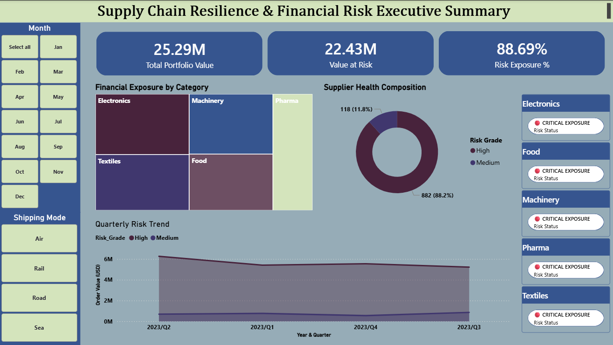

# Supply Chain Risk & Financial Exposure Analytics

**A procurement risk system that quantifies exactly how much capital is tied to unreliable suppliers — and surfaces it to decision-makers in real time.**

> **Stack:** Python · SQL (BigQuery) · Power BI (DAX)  
> **Domain:** Supply Chain Risk Management · Procurement Analytics  
> **Data:** Simulated logistics dataset ([Kaggle](https://www.kaggle.com/))

---

## The Problem

Most procurement teams track *average* lead times. But averages hide the real risk.

A supplier with a 10-day average lead time and a standard deviation of 8 days is far more dangerous than one with a 15-day average and a standard deviation of 1 day. The first supplier is unpredictable — and unpredictability forces a company into one of two costly positions: hold excess safety stock (capital tied up) or risk stock-outs (revenue lost).

**This project answers the question procurement leaders rarely can: how much money is currently at risk due to supplier unreliability?**

---

## Key Results

| Metric | Value |
|---|---|
| Total Portfolio Value | $25.29M |
| **Value at Risk (VaR)** | **$22.43M** |
| Risk Exposure % | 88.69% |
| Categories in Critical Status | Electronics, Pharmaceuticals |

88.69% of the total procurement portfolio is tied to High Volatility suppliers. In a healthy supply chain, this figure typically sits below 30%. The current state means almost any supplier disruption has material financial consequences.

---

## Dashboard

[](power_bi/dashboard_screenshot/executive_summary.png)

*Page 1 — Executive Risk Overview: KPI cards, Financial Exposure by Category (bubble chart), Supplier Health Composition (donut chart)*

---

## How It Works

The project runs in three sequential layers:

### 1. Statistical Modelling (Python)

**Volatility Index** — the core metric — is defined as the standard deviation of historical lead times per supplier:

```
Volatility Index (VI) = Standard Deviation of Lead Times per Supplier
```

A higher VI means delivery times are highly unpredictable, requiring larger safety buffers and creating greater financial exposure.

Suppliers are then classified into risk grades using **percentile-based thresholds** — chosen because they self-calibrate as the supplier portfolio changes, avoiding arbitrary hard-coded cutoffs:

| Risk Grade | Threshold | Meaning |
|---|---|---|
| 🔴 HIGH | VI > 75th percentile | Highly unpredictable — immediate action required |
| 🟡 MEDIUM | 25th–75th percentile | Moderate variability — monitor quarterly |
| 🟢 LOW | VI < 25th percentile | Reliable delivery — preferred supplier |

**Value at Risk** is then calculated as:

```
VaR = Σ (Unit Cost × Order Volume) for all HIGH grade suppliers
```

This produces a single, defensible financial number representing how much capital is exposed to supply disruption risk.

---

### 2. Data Engineering (SQL / BigQuery)

Python outputs are loaded into BigQuery and restructured into a **Star Schema** for dashboard performance:

```
fact_orders
    ├── dim_supplier   (VI score, risk grade, supplier metadata)
    ├── dim_product    (category, SKU, unit cost band)
    └── dim_date       (standard date dimension for DAX time-intelligence)
```

Three pre-calculated **views** handle the heavy aggregation upstream of Power BI:

- `vw_supplier_var` — aggregates VaR by supplier, pre-joining risk grade and spend
- `vw_category_exposure` — rolls up financial exposure to category level, including the CRITICAL flag logic
- `vw_supplier_reliability_matrix` — produces dual-axis data (avg lead time vs. volatility) for the scatter plot

Pre-calculating in SQL means dashboard queries run in under 2 seconds regardless of dataset scale.

---

### 3. Executive Dashboard (Power BI / DAX)

Built as a 2-page interactive cockpit serving two audiences simultaneously:

**Page 1 — Executive Risk Overview**
- KPI cards: Total Portfolio Value, VaR, Risk Exposure %, Critical supplier count
- Financial Exposure by Category bubble chart (bubble size = spend; colour = exposure status)
- Supplier Health Composition donut chart (spend proportion by risk grade)

**Page 2 — Supplier Audit List**
- Supplier Reliability Matrix: scatter plot of Average Lead Time vs. Volatility Index, with quadrant shading to identify the "Double-Loss" zone (slow *and* unpredictable)
- Filterable supplier table with Risk Grade, VI score, spend exposure, and recommended action

Key DAX measures:

```dax
VaR = 
    CALCULATE(
        SUM(fact_orders[spend]),
        dim_supplier[risk_grade] = "HIGH"
    )

Risk Exposure % = DIVIDE([VaR], [Total Portfolio Value], 0)

Exposure Status = IF([Risk Exposure %] > 0.80, "CRITICAL", "MODERATE")
```

---

## Key Findings

**1. The 88% Concentration Problem**  
Nearly all procurement spend is concentrated with High Volatility suppliers. Any supplier disruption will have material consequences — there is almost no low-risk buffer in the current portfolio.

**2. Electronics & Pharma — Critical Exposure**  
Electronics carries the highest spend combined with the highest volatility. Pharmaceuticals adds regulatory risk that amplifies the impact of delivery delays. Both categories require immediate action.

**3. The Lead Time Paradox**  
Several suppliers with short average lead times (under 5 days) carry the highest Volatility Index scores. Procurement decisions based on average lead time alone systematically underestimate risk from these suppliers.

**4. The "Double-Loss" Supplier Zone**  
The Supplier Reliability Matrix identifies suppliers with lead times over 10 days *and* high volatility — slow and unpredictable. These represent the single biggest lever for cost reduction.

---

## Recommended Actions

1. **Audit the top 5 HIGH risk suppliers** in the Audit List — renegotiate with tighter SLA windows and penalty clauses for breaches. Prioritise Electronics first.
2. **Dual-source critical Electronics and Pharma suppliers** within 90 days using LOW risk suppliers from the same categories as backup candidates.
3. **Increase safety stock buffers** for CRITICAL categories proportional to their VI score — a supplier with VI of 8 should carry a larger buffer than one with VI of 3.
4. **Re-score suppliers quarterly** to catch risk grade escalations before they become incidents.

---

## Limitations

This model is transparent about its boundaries:

| Limitation | Impact | Path Forward |
|---|---|---|
| Lead time is the only risk variable | Demand volatility and price fluctuations also drive financial exposure | Add demand standard deviation to a composite risk index |
| Assumes normally distributed lead times | Right-skewed distributions underestimate tail risk | Run Shapiro-Wilk test; apply log-normal VaR if skewed |
| Static risk grades | Supplier performance changes over time | Automate monthly re-scoring via a scheduled Python pipeline |
| Simulated dataset (Kaggle) | Results cannot be directly applied to real decisions without validation | Validate methodology against 12 months of real transactional data |

---

## Repo Structure

```
supply_chain_risk_analysis/
│
├── python/                         # Jupyter notebooks
│   ├── 01_data_cleaning.ipynb      # Ingestion, null handling, normalisation
│   ├── 02_volatility_index.ipynb   # VI calculation, CV scoring
│   └── 03_risk_grading.ipynb       # Percentile thresholds, risk classification
│
├── sql/                            # BigQuery scripts
│   ├── star_schema_ddl.sql         # Fact & dimension table definitions
│   └── views.sql                   # vw_supplier_var, vw_category_exposure, vw_supplier_reliability_matrix
│
├── data_file/                      # Source CSV files (Kaggle dataset)
│
├── power_bi/                       # Power BI files
│   ├── supply_chain_risk.pbix
│   └── dashboard_screenshot/
│
└── Technical Documentation.pdf     # Full project case study
```

---

## Technical Documentation

A full case study document is available in this repository: [`Technical Documentation.pdf`](Technical%20Documentation.pdf)

It covers the complete methodology, formula derivations, schema design, DAX logic, limitations analysis, and a recommended enhancement roadmap.

---

*Data source: [Kaggle Supply Chain Dataset](https://www.kaggle.com/) · Simulated for portfolio purposes*
